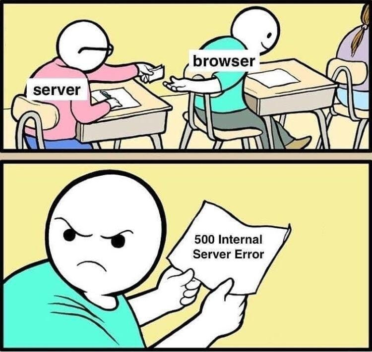

# Postmortem

### Issue Summary:

- Duration:
   * Start Time: February 15, 2024, 10:00 AM UTC
   * End Time: February 15, 2024, 10:15 AM UTC

- Impact:
  * The web application experienced a 15-minute outage.
  * The outage caused Users to encountered HTTP 503 errors.
  * Approximately 80% of users were affected.

- Root Cause:
  * Syntax error in the file `/var/www/html/wp-settings`.php

### Timeline
- 9:40 M UTC:
  * The Puppet manifest, intended to replace ".phpp" occurrences in `/var/www/html/wp-settings.php`, was applied.
- 10:05 PM UTC:
  * Monitoring detected a surge in HTTP 503 errors.
  * Engineers were alerted.
- 10:10 PM UTC:
  * Initial investigation identified a syntax error in the Puppet manifest.
  * Strace was used to trace the execution and identify the failing command.
- 10:13 PM UTC:
  * Engineers corrected the Puppet manifest to include the missing command attribute.
- 10:15 PM UTC:
  * The corrected manifest was applied, and the Apache web server service was restarted.

### Root Cause and Resolution
- Root Cause:
  * The root cause of this issue is a syntax error in the wp-settings.php file located at `/var/www/html/`. This file is included by WordPress when it starts up, so any syntax errors in this file will cause WordPress to fail.
- Resolution:
  * Wrote a Puppet manifest to replace ".phpp" occurrences in the wp-settings.php file.
  * After applying the corrected manifest, the Apache web server service was manually restarted, restoring service functionality.

### Corrective and Preventative Measures:
- Improvements/Fixes:
  * Enhance testing procedures to include thorough validation of configuration changes before applying them in production environments.
- Tasks:
  * Perform a comprehensive evaluation of the deployment procedure to guarantee rigorous testing of code modifications prior to deployment.
  * Establish recurring examinations of the application's error logs to preemptively detect any emerging issues.
  * Introduce a post-deployment validation phase to confirm the reliability and stability of the application.

### Conclusion:
This incident highlights the importance of rigorous testing and validation procedures in configuration management processes. By implementing corrective measures and enhancing preventative measures, we aim to minimize the risk of similar incidents and ensure the stability and reliability of our infrastructure.